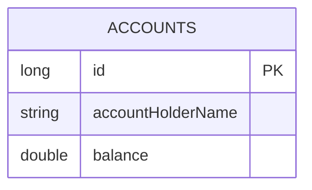

# 🏦 Simple Banking Application - Spring Boot REST API


A modern and minimalistic Spring Boot application that simulates basic banking operations using a RESTful architecture. Perform account creation, deposit/withdraw transactions, and view balances via API calls.

---

## 📁 Project Structure

```
SimpleBankingApplication/
├── controller/        # Handles API requests
│   └── AccountController.java
├── service/           # Contains business logic
│   ├── AccountService.java
│   └── AccountServiceImpl.java
├── repository/        # Spring Data JPA interfaces
│   └── AccountRepository.java
├── entity/            # JPA entity classes
│   └── Account.java
├── dto/               # Data Transfer Objects
│   └── AccountDto.java
├── mapper/            # DTO <-> Entity mapper
│   └── AccountMapper.java
├── BankingApplication.java
└── application.properties
```

---

## 🚀 Features

- 🧾 **Account Management**: Create, view, and delete accounts
- 💰 **Deposit Funds**: Add money to an account
- 🏦 **Withdraw Funds**: Safely withdraw from an account with validation
- 📊 **Balance Overview**: View balances and all accounts in the system
- ⚙️ **Layered Architecture**: Clean separation of concerns

---

## 🧱 System Architecture

```mermaid
flowchart TD
    A[Client (Postman/React)] --> B[Controller Layer]
    B --> C[Service Layer]
    C --> D[Repository Layer]
    D --> E[H2 / MySQL Database]

    style A fill:#f9f,stroke:#333,stroke-width:1px
    style B fill:#bbf,stroke:#333,stroke-width:1px
    style C fill:#bdf,stroke:#333,stroke-width:1px
    style D fill:#dfb,stroke:#333,stroke-width:1px
    style E fill:#fbb,stroke:#333,stroke-width:1px
```

---

## 🔗 REST API Endpoints

| Method | Endpoint                        | Description               |
|--------|----------------------------------|---------------------------|
| POST   | `/api/accounts`                 | Create new account        |
| GET    | `/api/accounts/{id}`           | Get account details       |
| PUT    | `/api/accounts/{id}/deposite`  | Deposit to account        |
| PUT    | `/api/accounts/{id}/withdraw`  | Withdraw from account     |
| GET    | `/api/accounts`                | List all accounts         |
| DELETE | `/api/accounts/{id}`           | Delete account by ID      |

---

## 🧪 Sample Curl Requests

**➕ Create an Account**
```bash
curl -X POST http://localhost:8080/api/accounts -H "Content-Type: application/json" -d '{"accountHolderName":"John Doe", "balance":1000}'
```

**💰 Deposit Money**
```bash
curl -X PUT http://localhost:8080/api/accounts/1/deposite -H "Content-Type: application/json" -d '{"amount":500}'
```

**💸 Withdraw Money**
```bash
curl -X PUT http://localhost:8080/api/accounts/1/withdraw -H "Content-Type: application/json" -d '{"amount":200}'
```

---

## 🗃 Database Schema (ER Diagram)



---

## 🛠 Getting Started

### Prerequisites
- Java 17+
- Maven 3.6+
- (Optional) MySQL or use H2 for in-memory testing

### Run the App

```bash
git clone https://github.com/yourusername/SimpleBankingApplication.git
cd SimpleBankingApplication
mvn spring-boot:run
```

API runs at: `http://localhost:8080/api/accounts`

---

## 📌 Notes

- Uses DTOs for data safety and clean API contract.
- Auto-incremented ID using `GenerationType.IDENTITY`.
- Designed with service abstraction for scalability.
- Exception handling uses basic `RuntimeException` for now.

---

## 👨‍💻 Author

**Abhijeet Tilekar**  
🔗 [GitHub Profile](https://github.com/yourusername)

---

> 💡 *“Code like you mean it. Bank like it matters.”*
